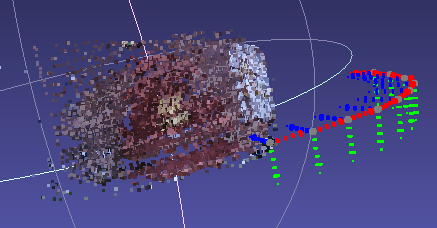

# Stereo 3D Reconstruction

The README is divided into two parts,
1. Structure from Motion (For camera parameters and sparse reconstruction)
2. Multiview Stereo (For dense reconstruction)

# Structure from Motion (SfM)

## Steps to Execute

1. Clone the repository as ```git clone https://github.com/FlagArihant2000/structure-from-motion```
2. ```cd structure-from-motion```
3. Run ```python3 sfm.py```.
4. If executed successfully, open ```stereo.ply``` with meshlab, in order to see the sparse reconstruction. 
5. To analyse the camera poses, click on ```import meshes``` on the top left and select ```camerapose0.ply``` to ```camerapose9.ply```.

## Pipeline
1. Acquiring image pair at a time.
2. Detection of features using SIFT.
3. Feature matching using brute force KNN. Good feature matches are by taking the distance ratio (According to Lowe's paper) as 0.7.
4. Calculation of Essential matrix, to relate the camera locations. Outliers are rejected using RANSAC.
5. Equivalent rotation matrix (R) and translation vector (t) are taken from essential matrix using SVD.
6. Projection matrix for each camera location is calculated, and triangulation of point correspondences are calculated.
7. The quality of triangulation is done using re-projection error. The triangulated points are re - mapped onto the image plane and the deviation between the matching points is calculated. (Note that in the code, rotation matrix is converted into vector using Rodrigues equation).
8. An optional step is added, that is, minimising of re-projection error using bundle adjustment. The triangulated points and projection matrices are stacked and converted to feature vector. Then, re-projection error is considered as cost function and optimisation is done using non - linear least squares method (Levenberg Marquardt method).
9. The 3D points are converted into point cloud format, along with the corresponding pixel colour at that location, which is then stored in ```stereo.ply```.

## Dataset

The dataset used is fountain - P11 ([Link](https://github.com/openMVG/SfM_quality_evaluation/tree/master/Benchmarking_Camera_Calibration_2008/fountain-P11)).

A sample image:


### Output

The output is without bundle adjustment since it is extremely computationally expensive. Currently working on speeding up that process.



## TO DO

1. Speed up bundle adjustment.
2. Sparse to Dense using MVS. (Camera Poses Obtained from SfM) (```mvs.py```)

# Multiview Stereo (MVS)

While there are several methods available in the literature for stereo, we choose to work on patch based reconstruction.

## Steps to Execute (Under Development)

1. Execute the SfM pipeline.
2. Run ```python3 mvs.py```.


### Team Members

1. Arihant Gaur
2. Saurabh Kemekar

