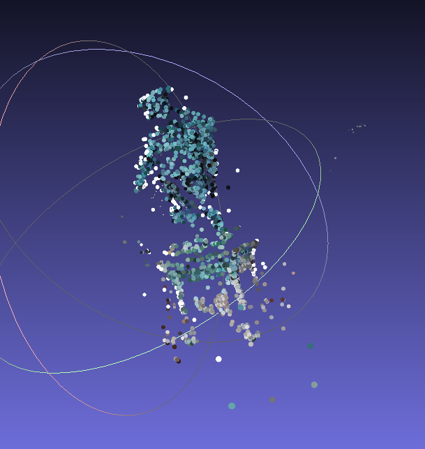

# Stereo 3D Reconstruction

The README is divided into two parts,
1. Structure from Motion (For camera parameters and sparse reconstruction): Here, incremental structure from motion is implemented.
2. Multiview Stereo (For dense reconstruction): Will be done later.

## Structure from Motion (SfM)

### Steps to Execute

1. Clone the repository as ```git clone https://github.com/FlagArihant2000/sfm-mvs```
2. ```cd sfm-mvs```. The directory for the image directory (Line 30), along with the camera parameters (Line 16) can be updated accordingly.
3. Run ```python3 sfm.py```.
4. If executed successfully, open ```sparse.ply``` to analyse the sparse reconstruction using meshlab.

### Pipeline
1. Acquire the first image pair.
2. Detection of features using SIFT.
3. Feature matching using brute force KNN. Good feature matches are by taking the distance ratio (According to Lowe's paper) as 0.7.
4. Calculation of Essential matrix, to relate the camera locations. Outliers are rejected using RANSAC.
5. Equivalent rotation matrix (R) and translation vector (t) are taken from essential matrix using SVD.
6. Projection matrix for each camera location is calculated, and triangulation of point correspondences are calculated.
7. The correctness of triangulated points is analysed using re-projection error. The triangulated points are re - mapped onto the image plane and the deviation between the matching points is calculated. (Note that in the code, rotation matrix is converted into vector using Rodrigues equation). This will be the base point cloud, onto which newly registered images will be added.
8. A new image is taken into consideration, which shall be registered using Perspective - n - Point (PnP). For this, we need the 3D - 2D correspondence for the new image. So, the features common for image 2 and 3 are taken into consideration and only those points are taken for PnP which are visible in the newly added image (data association). After PnP, we get the world pose estimate of the image.
9. This image can now see new points, which were not there in original point cloud. So, triangulation is done for the same. Again the reprojection error is calculated.
10. Now, for each newly added image, the pipeline will repeat from step 8.

### Dataset

The dataset used is a statue of Gustav II Adolf ([Link](http://www.maths.lth.se/matematiklth/personal/calle/dataset/dataset.html)). All the images have been used for obtaining the sparse point cloud.

A sample image:


### Output




### Team Members

1. Arihant Gaur
2. Saurabh Kemekar

IMPORTANT: Due to the lack of time, it wasn't possible to extend this project. Maybe in the near future, we would be able to optimize bundle adjustment, increase data association size, and incorporate Multiview Stereo. This is purely a project to learn and understand 3D Reconstruction of large scale data, and implement in an understandable manner, using python. Do NOT use it for research purposes. Use other incremental SfM pipelines like COLMAP.
